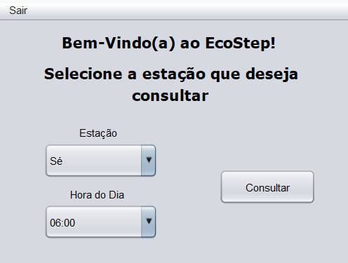
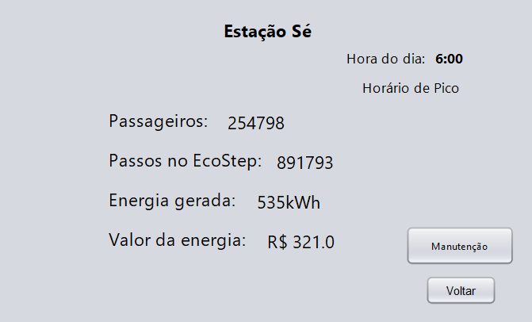
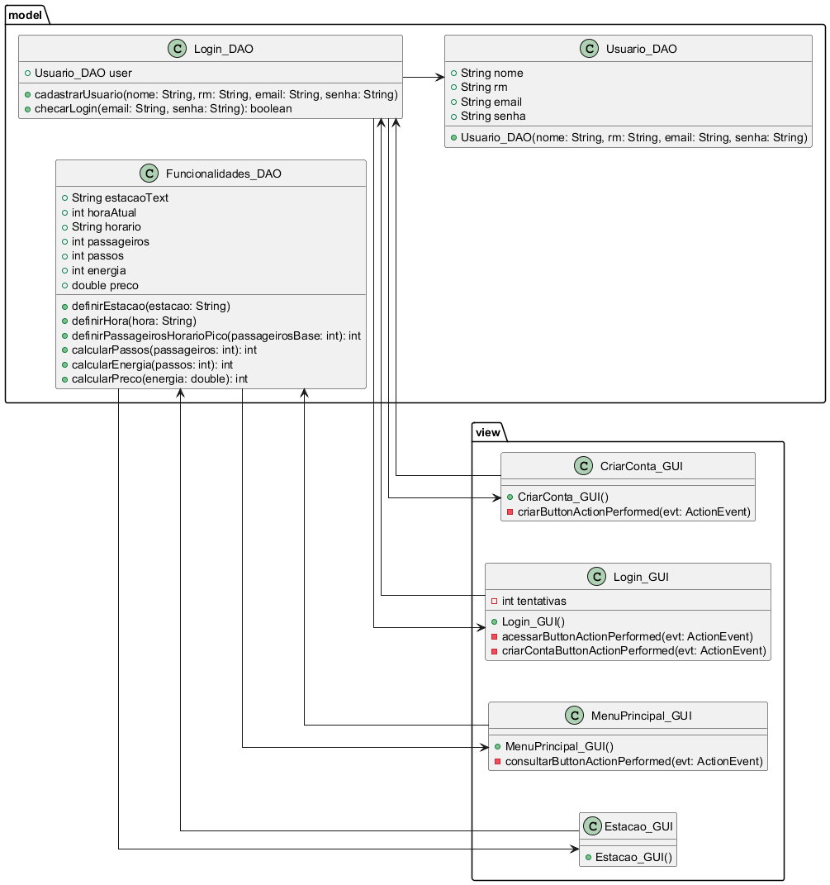

# EcoStep - Global Solution FIAP 2024

## Faculdade de Informática e Administração Paulista  
**Global Solution - Semestre 4**  
**Domain Driven Design**

### Integrantes do Grupo:
- Adriano Lopes Sampaio Santana (RM: 98574)
- João Antonio Rihan (RM: 99656)
- Rodrigo Fernandes Serafim (RM: 550816)

---

## Descrição do Projeto

**EcoStep** é um sistema inovador que transforma o movimento humano em energia renovável por meio de pisos inteligentes. Essa tecnologia é projetada para locais de alto fluxo, como estações de metrô, calçadas e centros urbanos, aproveitando a energia gerada pelos passos para contribuir com o abastecimento energético sustentável.

O projeto será inicialmente implantado nas estações mais movimentadas de São Paulo, como a Linha Vermelha e a Estação Luz, onde o intenso tráfego diário de passageiros possibilita uma geração significativa de energia limpa. O **EcoStep** visa integrar-se ao ambiente urbano de maneira funcional e eficiente, promovendo o uso responsável dos recursos naturais sem comprometer os espaços de circulação. 

Com isso, cada passo dado pelos cidadãos se torna uma contribuição direta para um futuro mais sustentável.

---

## Objetivos

O principal objetivo do sistema em Java é proporcionar aos administradores da rede do metrô fácil acesso às informações de cada estação onde o **EcoStep** está instalado. Além disso, o sistema facilita a requisição de manutenções e a visualização de dados importantes, como a taxa de energia gerada e o número de passageiros.

---

## Tecnologias Utilizadas

- **Java** - Linguagem de Programação
- **Domain Driven Design** - Arquitetura e Desenvolvimento do Sistema

---

## Como Funciona

O **EcoStep** utiliza pisos inteligentes para capturar a energia gerada pelos passos das pessoas, convertendo-a em eletricidade. As estações do metrô de São Paulo serão os primeiros locais a implementar essa tecnologia. O sistema fornecerá dados em tempo real sobre a quantidade de energia gerada e o tráfego de passageiros nas estações, além de permitir que os administradores solicitem manutenções de forma rápida e eficiente.

---

## Capturas de Tela

---

## Diagrama UML

