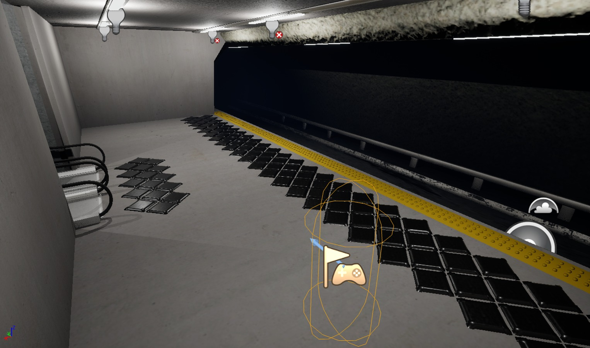
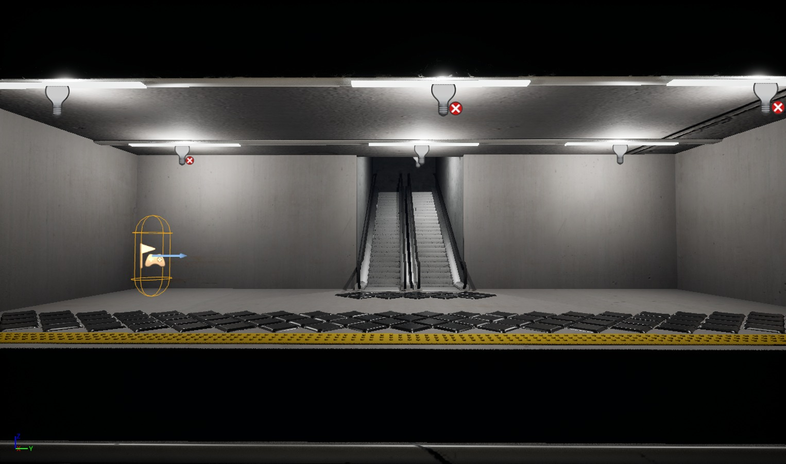
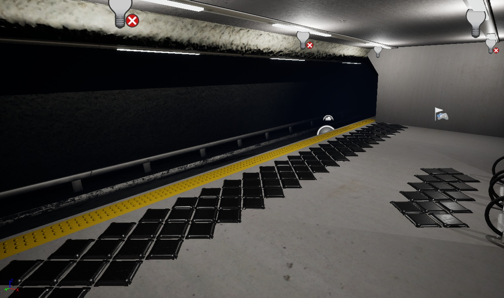
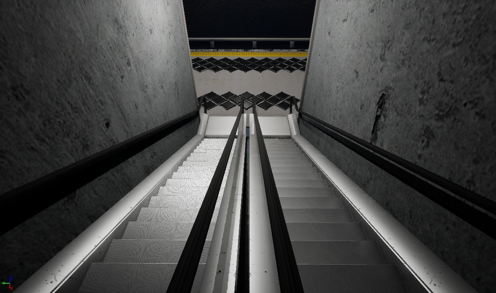

# EcoStep - AR/VR Modelling and Simulation
Autores:  
- Adriano Lopes Sampaio Santana (RM: 98574)  
- João Antonio Rihan (RM: 99656)  
- Rodrigo Fernandes Serafim (RM: 550816)

## Sobre o Projeto

O **EcoStep** é um sistema inovador que transforma o movimento humano em energia renovável por meio de pisos inteligentes. Desenvolvido para locais de alto fluxo, como estações de metrô, calçadas e centros urbanos, ele utiliza a energia gerada pelos passos para contribuir com o abastecimento energético sustentável.

### Implementação Inicial
A implementação inicial será nas estações mais movimentadas de São Paulo, como:
- **Linha Vermelha**
- **Estação Luz**

Esses locais foram escolhidos devido ao intenso tráfego diário de passageiros, possibilitando uma geração significativa de energia limpa. O objetivo é integrar a solução ao ambiente urbano de forma funcional e eficiente, promovendo o uso responsável dos recursos naturais sem comprometer os espaços de circulação.

## Desenvolvimento Técnico

- **Modelagem 3D:** Realizada na plataforma Maya.
- **Simulação:** Texturização, iluminação e funcionalidade implementadas na Unreal Engine utilizando blueprints.
- **Simulação de Energia:** Os blueprints demonstram a geração de energia com passos, representada visualmente pelo acendimento de luzes.

## Capturas de Tela

### Cenário Esquematizado

---

### Observação

As capturas de tela podem apresentar alta granularidade devido às limitações do hardware utilizado durante o desenvolvimento.
